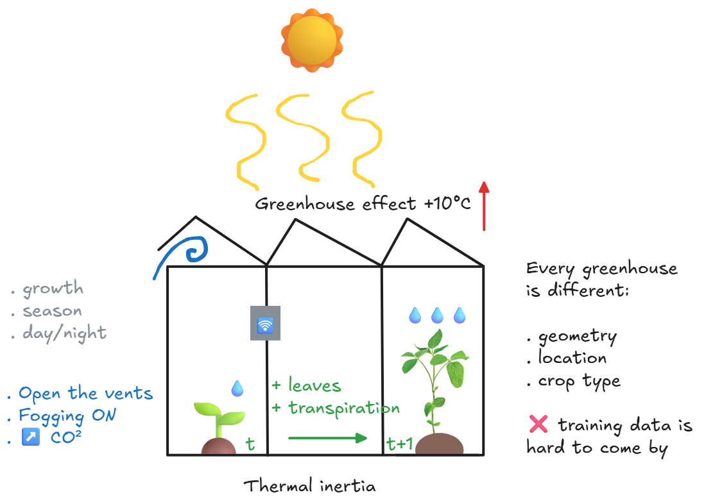

<!-- _paginate: false -->

# Online learning vs Batch learning
Learning from the flow, or not?
<br>
Use case: predict the temperature of a greenhouse from historical sensor data and outdoor weather.

 

---

<!-- _backgroundColor: white -->

## Domain knowledge: greenhouse characteristics



---

<!-- _footer: "¹ Candanedo, L. (2017). Appliances Energy Prediction. UCI Machine Learning Repository. https://archive.ics.uci.edu/dataset/374/appliances+energy+prediction" -->

## Data

For this workshop, public data: UCI Appliances Energy Prediction¹
. indoor temperature/humidity sensors + outdoor weather station
. recorded every 10 min, January → May 2016 (~20,000 rows)

Questions to ask:
. target? num or cat
. features? num or cat
. time feature? yes or no

📊 Todo:
Data analysis matters: it checks data quality and makes sure what we are looking for is actually in the data. It also guides the choice of model: linear or tree-based.

---

## What does it mean to train a model?
. drawing: baby crow (model) in a river (information), next to a dam (information) + concepts floating in the water + IN/OUT
. A model = a function `out = f(in)` with adjustable parameters

Example:
`T_int ≈ a × T_ext + b × humidity + c × hour + d`
         → the model looks for the right `a`, `b`, `c`, `d`

---

<!-- _footer: "² scikit-learn, LinearRegression: https://scikit-learn.org/stable/modules/generated/sklearn.linear_model.LinearRegression.html<br>³ river, LinearRegression: https://riverml.xyz/latest/api/linear-model/LinearRegression/" -->

## Our experiment
Three learning strategies, same model linear regression, same inputs:
1. 🧊 Frozen batch: trained on Jan & feb, never updated, scikit-learn²
2. 🔁 Retrained batch: retrained every week on all past data, scikit-learn²
3. 🌊 Online: updated at every measurement, river³

---

## 🧊 Batch learning

<div class="cols">
<div>

```
full history
  ↓
features
  ↓
train (only once)
  ↓
frozen model
  ↓
┌──→ new features (t)
│      ↓
│    prediction
│      ↓
└──── next features (t+1)

```
Diagram 1: batch model, frozen

</div>
<div>

- Learns once from a batch of data
- The model is then frozen and deployed
- To update it: retrain with all data

+/- pour la greenhouse: energy cost, model size, data storage

</div>
</div>

---

<!-- _footer: "⁴ Online machine learning, Wikipedia: https://en.wikipedia.org/wiki/Online_machine_learning" -->

## 🌊 Online learning⁴

<div class="cols">
<div>

```
┌──→ new features (t)
│      ↓
│    target prediction
│      ↓
│    true target, measured
│      ↓
│    train: small correction
│      ↓
└──── next features (t+1)
```
Diagram 2: online model, learning on the flow

</div>
<div>

- The model learns from each new measurement, with a small correction
- No history kept: each measurement is seen, used, then forgotten
- The model is always up to date

Pros (+) and cons (-):
. follows data drift (e.g. climate change); you may need to define the type and speed of drift
. energy cost, model size, data storage

Time series specifics: forgetting, the past becomes outdated

Analogy: an adaptive controller or a recursive filter (like a Kalman filter).

</div>
</div>

---

<!-- _footer: "⁵ scikit-learn, mean_absolute_error: https://scikit-learn.org/stable/modules/generated/sklearn.metrics.mean_absolute_error.html<br>⁶ river, metrics.MAE: https://riverml.xyz/latest/api/metrics/MAE/" -->

## Evaluation

Metric: mean absolute error (MAE), in °C (batch: scikit-learn⁵, online: river⁶)

$$\text{MAE} = \frac{1}{n} \sum_{i=1}^{n} \left| y_i - \hat{y}_i \right|$$

. yᵢ: true value, ŷᵢ: predicted value, n: number of measurements
. meaning: on average, how many °C is the model off?

- Batch: train on the past, test on what comes next (⚠️never shuffle time series!)
- Online: prequential evaluation = predict first, then learn
  → when predicting, the model has never seen the answer

---

## Results: mean error (MAE) in °C

| Month | 🧊 Frozen batch | 🔁 Retrained batch | 🌊 Online |
|---|---|---|---|
| January | 0.84 | – | 0.93 |
| February | 1.43 | 1.07 | 0.16 |
| March | 1.72 | 0.83 | 0.14 |
| April | 2.81 | 0.89 | 0.14 |
| May | 5.07 | 1.33 | 0.18 |

The frozen batch gets worse month after month. Online stays stable.

---

## Pros & cons

| Strategy | + | − |
|---|---|---|
| 🌊 Online (river) | + no retraining on all data: low memory (RAM)<br>+ no initial training set: learns from the flow | - faulty sensor → the model learns the errors<br> - sensitive tuning: learning rate too high → diverges |
| 🧊 Frozen batch | + simple and stable: easy to validate and audit | - gets outdated when conditions change (drift) |
| 🔁 Retrained batch | + follows changes, each version can be checked | - keeps all history, retraining cost every time<br> - needs trainset to start |

The online approach is closer to how things live and change in real life. It helps build models that are ready to leave the lab.

---

## Notebook
Time to practice 🤖🤖🤖

---